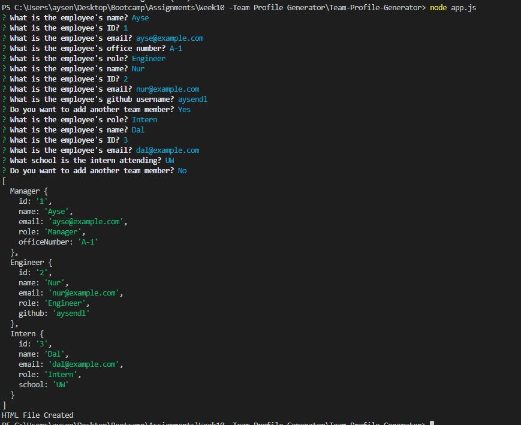
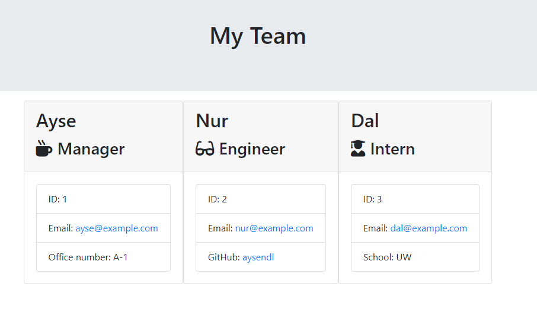
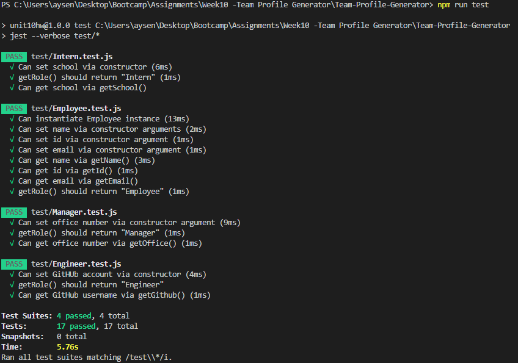

# Team-Profile-Generator

A nodejs application for building a software engineering team generator command line application. The application will prompt the user for information about the team manager and then information about the team members. The user can input any number of team members, and they may be a mix of engineers and interns. This assignment must also pass all unit tests. When the user has completed building the team, the application will create an HTML file that displays a nicely formatted team roster based on the information provided by the user. 

## Usage

A series of questions will be asked sequentially starting with the manager. The user can add desired number of employees or interns to generate the desired html page. Application will override the existing html page.

Here is a screenshot which displays the questions:



## Rendered Page

The output is an HTML file generated under output/ directory. The generated page for the sample usage is:



## Tests

The tests can be run in this repository using the following command:
```
npm run test
```

Here is a screenshot which displays the tests:

